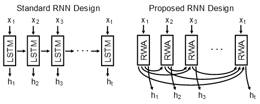

## Description

This repository holds the code to a new kind of RNN model for processing sequential data. The model computes a recurrent weighted average (RWA) over every previous processing step. With this approach, the model can form direct connections anywhere along a sequence. This stands in contrast to traditional RNN architectures that only use the previous processing step. A detailed description of the RWA model has been published online at [URL].

In each folder, the RWA model is evaluated on a different task. The performance of the RWA model is compared against a LSTM model. The RWA is found to train faster and generalize better on each task. Moreover, the computational overhead of the RWA model is found to scale like that of other RNN models. This is because the recurrent weighted average can be computed as a running average and does not need to be recomputed at each processing step.

## Download

* Download: [zip](https://github.com/jostmey/rwa/zipball/master)
* Git: `git clone https://github.com/jostmey/rwa`

## Requirements

The code is written in Python3. The models are implemented in TensorFlow using version 0.12.0-rc0.

